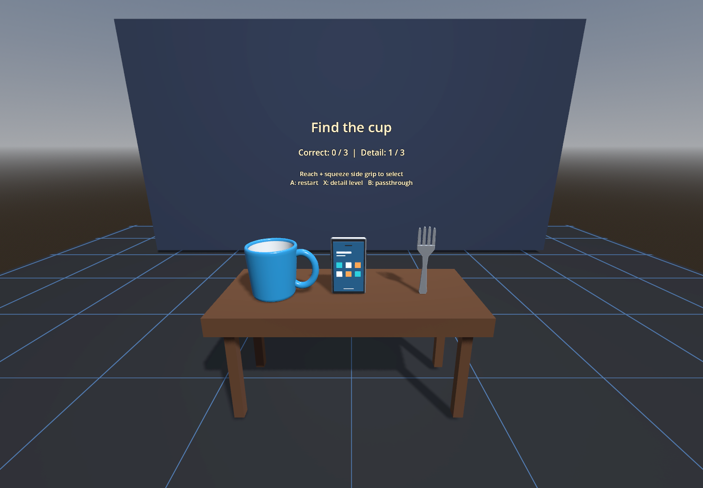

# Everyday Object Finder

A short VR object-recognition game built in Godot for **Meta Quest 3**, created for MP-216 Making VR Experiences. Find and grab a cup, phone, and fork to complete three rounds.



## Play on Quest 3

Use `EverydayObjectFinder-Quest3-Final.apk`, distributed separately from this source folder. When publishing this repository, attach that APK to a GitHub **Release** so players can download an installer without building the project.

1. Enable Developer Mode on the Quest and connect a USB data cable.
2. Accept the USB debugging prompt in the headset.
3. Install with your preferred Quest sideloading tool, or Android platform-tools:

```sh
adb devices
adb install -r EverydayObjectFinder-Quest3-Final.apk
adb shell am start -n com.example.everydayobjectfinder/com.godot.game.GodotAppLauncher -a android.intent.action.MAIN -c com.oculus.intent.category.VR
```

These commands assume one authorized Android device is connected. With multiple devices, add `-s YOUR_DEVICE_SERIAL` after `adb`. Later, open the game from **Unknown Sources** in the headset's app library. This is a standalone VR APK; it does not run inside a web browser. The demo APK is debug-signed for sideloaded testing.

## Rules and controls

- Reach a controller into the requested object and squeeze the side grip.
- Correct selections add a point and advance the round. Incorrect selections prompt a retry.
- Targets appear in this order: **cup, phone, fork**. A score of **3/3** completes the session.
- **A (right controller):** restart. **X (left):** change visual detail. **B:** toggle passthrough.
- Objects return to their starting positions when released or when a round resets.

## Open and edit

1. Download or clone this repository. If downloading a ZIP, extract it first.
2. In **Godot 4.7.2**, select **Import** and choose `project.godot`.
3. Allow the editor to import the assets. Required OpenXR vendor plugin binaries are included under `addons/`; do not omit its hidden `.bin` folder.

The project uses the Mobile renderer. No API key or online account is required by the game.

### Desktop preview

Run with XR disabled (replace `godot` with the path to your Godot executable if necessary):

```sh
godot --path . --xr-mode off
```

Keys **1/2/3** select objects, **R** restarts, and **L** changes detail. Desktop preview does not replace headset testing.

### Android export

Install matching Godot export templates and use **Project > Install Android Build Template** in the editor. Configure your own Android SDK and JDK in Godot, then use the included Android export preset and your own signing configuration. Create a `build` directory for the preset's output path. Generated Android build files, imported asset caches, and signing credentials are intentionally excluded from the repository.

### Interaction checks

```sh
godot --headless --editor --path . --import --xr-mode off
godot --headless --path . --xr-mode off --script tests/test_demo.gd
```

The checks cover target placement, visual-detail changes, wrong and correct grabs, completion, restart, and held-object cleanup. The original APK was installed and launched on Quest 3; runtime logs showed approximately 72 FPS after startup, and the creator confirmed hands-on operation.

## Project layout

- `main.tscn`, `main.gd`: scene and startup behavior.
- `scripts/`, `scenes/`: gameplay and XR interaction components.
- `assets/`: object models, controller models, and visual resources.
- `addons/`: installed OpenXR vendor extension and required binaries.
- `tests/`: automated interaction checks.
- `tools/create_models.py`: optional Blender script for regenerating the cup, phone, and fork models. Run with Blender's Python, not ordinary Python. The included GLB assets are ready to use; Blender is not needed to play or build the game.

## Research connection

Sinha, P. (2016). NeuroScience and service. *Neuron, 92*(3), 647–652. https://doi.org/10.1016/j.neuron.2016.10.044

This educational prototype explores object recognition and visual cues. It is not a clinical treatment or a reproduction of Project Prakash experiments. Its detail settings adjust materials and small model features; they do not implement amblyopia frequency-patching therapy.

## Credits and licenses

Based on the supplied **VR/AR@MIT Godot XR Project Template**; its original README is preserved as `TEMPLATE_README.md`. Custom object meshes and game refinements were produced with AI-assisted development and creator-directed testing.

See `THIRD_PARTY_NOTICES.md` and the original notices retained alongside the dependencies. No blanket open-source license has been assigned to this combined project; publishing its source does not replace the existing third-party license terms.
